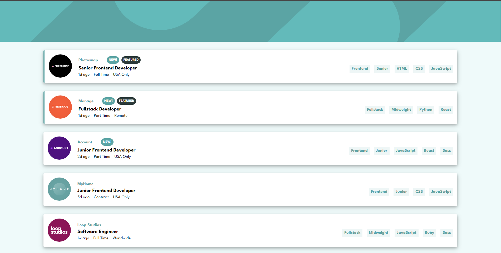
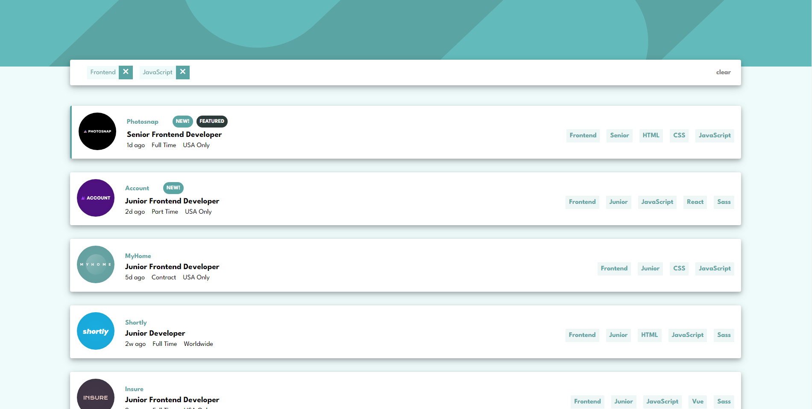
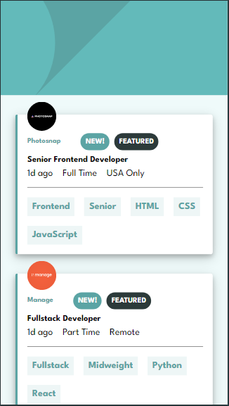

# Frontend Mentor - Job listings with filtering solution

This is a solution to the [Job listings with filtering challenge on Frontend Mentor](https://www.frontendmentor.io/challenges/job-listings-with-filtering-ivstIPCt). Frontend Mentor challenges help you improve your coding skills by building realistic projects.

## Table of contents

- [Overview](#overview)
  - [The challenge](#the-challenge)
  - [Screenshot](#screenshot)
  - [Links](#links)
- [My process](#my-process)
  - [Built with](#built-with)
  - [What I learned](#what-i-learned)
  - [Continued development](#continued-development)
  - [Author](#author)

## Overview

### The challenge

Users should be able to:

- View the optimal layout for the site depending on their device's screen size
- See hover states for all interactive elements on the page
- Filter job listings based on the categories

### Screenshot





### Links

- Solution URL: [Solution URL](https://github.com/henryapm/job-listing)
- Live Site URL: [Add live site URL here](https://henryapm.github.io/job-listing/)

## My process

### Built with

- Semantic HTML5 markup
- CSS custom properties
- Flexbox
- Mobile-first workflow
- [VueJs](https://vuejs.org/) - JS library

### What I learned

I'm excited to announce that I started to use css naming conventions, in this case I use BEM convention to write all my css class names that at the same time
helped me identifying the classes I needed to update while I was creating the solution of this challenge.

I'm also excited about the way I solved the filter function, in this case I needed to filter through the different skills, positions and tools that described
better what the company was listing as their technologies, and it was challenging at first to come up with that long line of code but it worked out. First
I make sure that we have elements to filter by checking the length, after that the function filters the job property, and if EVERY element includes the elements
listed on the filters property they will be returned to the filteredJobs computed property, and as it changes it updates the DOM with the new filters applied.

```css
.filter__element {
  display: flex;
  align-items: center;
  cursor: pointer;
}
```

```js
computed: {
      filteredJobs(){
        let filteredJobsArray = []
        if (this.filters.length > 0) {
          filteredJobsArray = this.jobs.filter(job => {
            return this.filters.every(property => {
              return Object.values(job).includes(property) || job.languages.includes(property) || job.tools.includes(property)
            });
          });
          return filteredJobsArray;
        } else {
          return this.jobs
        }
      }
    }
```

### Continued development

I want to keep learning more a more JS and be able to apply to real life problems, and help organizations figure out the challenges they can come across through
expanding my knowledge in the field, and also starting to learn more about app development in the world of vue native.

## Author

- Website - [My website](https://henryapm.github.io/)
- Frontend Mentor - [@henryapm](https://www.frontendmentor.io/profile/henryapm)
